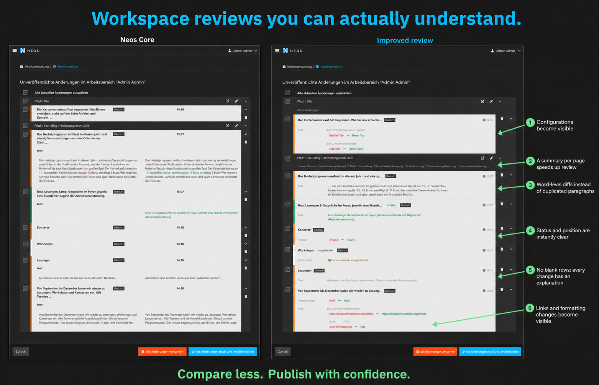
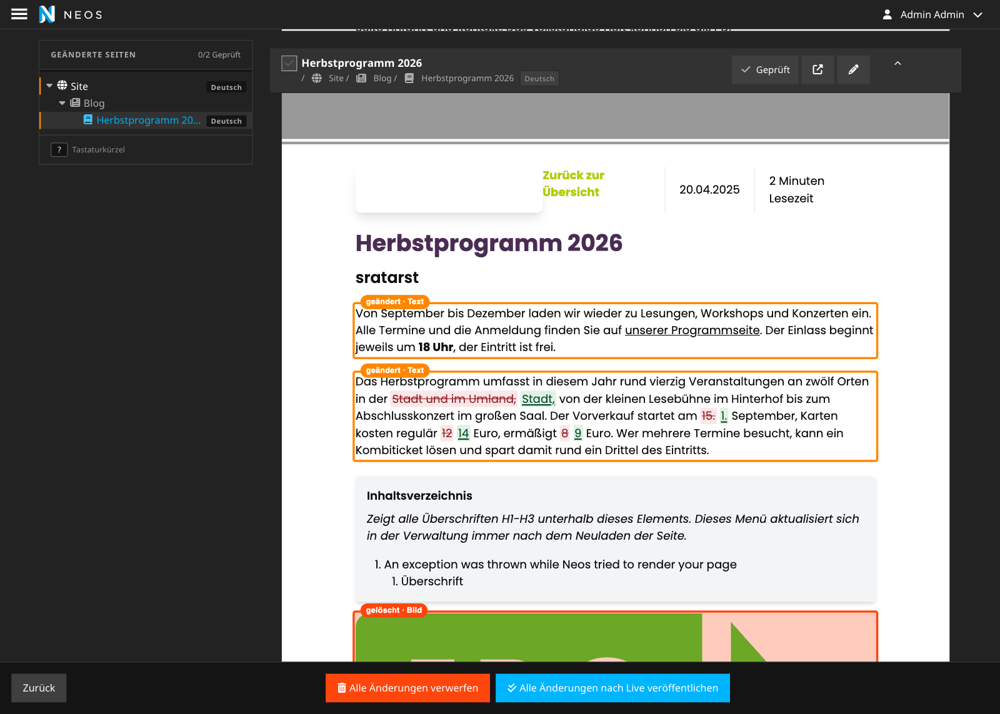

# CodeQ.WorkspaceReview

**Understand exactly what will change before publishing a Neos workspace.**





> This package is an experiment focused on exploring the workspace review UI.
> It is not optimized for code quality or production readiness.
> 

The package extends the workspace review with navigation, local review progress and a dedicated visual preview. Publishing, discarding and the workspace module path keep their existing behavior. The preview requires backend access and checks read access to private workspaces.

## Improvements at a glance

- **See changes on the page.** A view switch shows either the change list or a visual compare: the page rendered as it will look, with created, changed, moved, hidden and deleted elements marked in place and the changed words highlighted in the text. Deleted elements are taken from the published page and shown with a red overlay.
- **Track review progress.** Mark a page as reviewed to collapse it; the sidebar counts reviewed pages and remembers them per workspace, and flags a page that changed after it was reviewed.
- **Review from the keyboard.** J/K move between pages, [ / ] step through changes, V toggles the reviewed mark and D switches views. **?** opens the shortcut overview.
- **Jump between changed pages.** A sticky left sidebar lists the changed pages as a tree styled like the backend page tree, with their content dimension. The current page stays highlighted as you scroll, and each page is a separate block in the review.
- **Read changes in page order.** Within each page, cards follow the content tree's order, with containers before their children. Each card explains the individual change directly.
- **Configurations become visible.** Select boxes, toggles and references use translated editor labels instead of raw stored values.
- **Word-level diffs reduce noise.** Reviewers see the changed words instead of comparing two complete paragraphs. Long unchanged passages collapse to an ellipsis. Deleted words are struck through and added words underlined, so the diff does not rely on colour alone.
- **Status and position are instantly clear.** Created, deleted, moved and hidden elements receive explicit badges. Positions use readable sibling numbers instead of sorting indexes.
- **Every change has an explanation.** Visibility changes, reverted edits and internal updates no longer produce unexplained empty rows.
- **Links and formatting become visible.** Retargeted links, window behavior, linked text and formatting changes are detected even when the wording remains unchanged.
- **Visual compare keeps the changes in context.** Text changes can be reviewed in a page preview, and created, edited and deleted nodes are highlighted (still experimental). Clicking the info button jumps into the compare list view for details

## Installation

The package lives in `DistributionPackages` and is installed through the distribution's path repository:

```bash
composer require codeq/workspace-review
./flow flow:cache:flush
```

## What reviewers see

Every changed node becomes one card with one entry for each effect publishing would have. Cards are grouped beneath their page header, without a separate per-page change summary. When no renderable property changed, the card explains why instead of staying empty.

| Entry        | Appears when                                                                 | Reads like                                                          |
| ------------ | ---------------------------------------------------------------------------- | ------------------------------------------------------------------- |
| Text         | the wording changed                                                          | `… startet am ~~15.~~ 1. September, Karten kosten ~~12~~ 14 Euro …` |
| Link         | a link points elsewhere, opens differently, or words were linked or unlinked | `Link "Anfahrt und Kontakt" · Text Hero → Image Hero`               |
| Formatting   | the same words carry different formatting                                    | `"18 Uhr," · no formatting → bold`                                  |
| Value        | a property changed, shown with its editor labels                             | `Abstand unten · Groß → Klein`                                      |
| Position     | a node was reordered among its siblings                                      | `Position · 3 of 3 → 1 of 3`                                        |
| Image, Asset | media was replaced                                                           | the published and the new file side by side                         |
| Visibility   | a node was hidden or made visible                                            | `Element was hidden`                                                |
| Note         | nothing renderable changed                                                   | an explanation of the remaining difference                          |

The card header names the element type next to the node label, because the label is usually the element’s own text ("Minimalismus" alone does not say that a headline was hidden), and shows whether the node was created, deleted, moved or hidden. Only changed words are marked in the card body.

### Page navigation

The sidebar shows the changed pages in the order and nesting of the page tree, with the node type icons, indentation and colours of the backend page tree; changed pages carry its orange "unpublished changes" edge. An unchanged page between the site and a changed subpage is listed greyed and without a link, so the structure stays readable. Click a page to jump to its changes, or scroll the review normally with the mouse wheel. The sidebar follows the current page without moving keyboard focus. On smaller screens the index appears above the review.

Each content-dimension variant has its own destination. Links also work as ordinary anchors when JavaScript is disabled.

Within a page, the change list follows the content tree's sorting order. A changed container appears before its changed children, and those children stay together before the next sibling. This makes the list easier to follow alongside the page. Custom layouts can render content in a different visual order.

### Reviewed pages and progress

Every page header has a **Reviewed** toggle. Marking a page collapses its changes, greys its title, shows a green check in the sidebar and advances the progress bar in the sidebar header ("2/7 reviewed"). The chevron still expands a reviewed page for a second look without clearing the mark.

Reviewed marks are stored in the browser per workspace, together with a signature of the page's changes (which nodes, last modified when). If that signature changes after review, the mark is dropped on the next load and the page carries a **"Changed since your review"** badge. Hovering or focusing the badge explains what happened.

These marks are personal progress notes in that browser, not a shared approval workflow. They do not select changes for publishing or discarding, and they do not prevent either action. If browser storage is unavailable, progress lasts only for the current page view.

### Visual compare

Use the switch above the review stream, or press **D**, to toggle between the **change list** and **visual compare** shown in the second screenshot. Visual compare renders the reviewed workspace in the site's own layout and adds status labels and outlines to changed elements.

| Marker | Meaning |
| --- | --- |
| Green | Created element |
| Orange | Changed element |
| Blue | Moved element |
| Hatched grey | Hidden element that is present in the preview |
| Red overlay | Deleted element, restored from the published rendering for review |

Text edits appear in place when the new wording can be matched to a text element on the rendered page. Deleted words are struck through and additions underlined, using the same word diff as the change list. The preview combines the workspace rendering with review annotations, so deleted words and restored deleted elements will not appear on the published page.

Deleted elements are placed next to a surviving neighbour from the published page. If no neighbour survives, they appear in a separate section at the end of the page. New pages have a green banner. Deleted pages have a red banner and show their currently published content.

Click a marker's status label to switch to the corresponding change card, which receives focus and is briefly highlighted. Changes with no visible matching element, such as document properties, custom-rendered content or content inside a closed accordion, are listed below the frame with links to their cards. The change list also provides the full details for configuration, links and formatting.

Each preview scrolls independently. Link navigation and form submission are blocked inside it. Pages load as they approach the visible area, and the browser remembers the selected view.

### Keyboard review

Press **?** anywhere in the module, or use the button at the bottom of the sidebar, for an overview of all shortcuts. Shortcuts apply while nothing or a page, change or sidebar entry has focus; they stay off inside form controls and buttons, and modifier combinations are left to the browser.

| Keys | Action |
| --- | --- |
| **↓ / J**, **↑ / K** | next / previous page |
| **Home / End** | first / last page |
| **Enter** | focus the page in the review stream (from the sidebar) |
| **]** / **[** | next / previous change on the page; **[** on the first change returns to the page heading. In the visual compare the keys walk the markers on the page. |
| **V** | mark the page as reviewed / not reviewed |
| **D** | switch between change list and visual compare |
| **Esc** | from a change back to the page heading, from the page back to its sidebar entry, or close the overlay |

Without a focused element the keys act on the page currently shown at the top of the stream.

## Detailed behavior

### Text changes

Text is compared word by word. An unchanged run longer than two dozen words collapses to the words surrounding the edit plus an ellipsis.

Deleted words are struck through and added words underlined in addition to their red and green colouring, so the kind of change stays readable with a colour vision deficiency, in greyscale and in forced-colours mode. Screen readers hear “deleted:” or “added:” before each edited run, because `<del>` and `<ins>` alone are not reliably announced.

HTML entities are decoded before comparison and in labels, so titles show `&` instead of the literal entity `&amp;`.

### Configuration values

Select boxes and toggles use translated `editorOptions.values` labels, such as “Kein Abstand” instead of `none`. Booleans render as Yes or No, and references render as node labels.

A property changed back to its NodeType default is still reported instead of being silently omitted.

### Links and formatting

A text comparison cannot see markup-only edits. Rich text is therefore compared a second time to detect links and formatting while keeping the findings conservative.

- **A link points somewhere else.** Internal `node://` and `asset://` targets resolve to page and asset names instead of exposing UUIDs.
- **A link behaves differently.** A new-window change reads `Same tab → New tab`.
- **Words were linked or unlinked.** This is reported when the surrounding wording is unchanged. When the text also changed, the text diff owns the explanation.
- **Formatting changed.** Bold, italic, underline, strikethrough, subscript, superscript, code, highlight and heading-level changes are reported per passage.

When two targets resolve to the same label, their raw URIs remain visible so the result never claims `X → X`.

### Position and status

A moved node shows its place among siblings, such as `3 of 3 → 1 of 3`, instead of an internal sorting index such as `100 → 150`.

An index changed only by sibling renumbering is identified as internal re-sorting. Created, deleted, moved and hidden nodes receive explicit, correctly translated badges.

### Changes without a visible diff

The review uses three distinct notes when it cannot show a normal value comparison:

- **“Changed – the wording is unchanged, please check details in the preview.”** The stored value differs, but the visible words do not. The property name tells the reviewer where to look.
- **“Edited, but matching the published version again – no content differences found.”** The node was changed and then restored. Publishing it has no effect.
- **“No visible changes (internal update).”** The node differs, but the change cannot be attributed to a renderable field.

These distinctions help reviewers decide whether they need to open the preview or can safely discard a reverted change.

## Technical implementation

- `Configuration/Settings.yaml` replaces the controller of `management/workspaces` with `CodeQ\WorkspaceReview\Controller\Module\Management\WorkspacesController`.
- The controller extends the Neos core controller, builds readable diffs, groups documents in page-tree order and sorts each document's changes by their content-tree positions.
- `Resources/Public/JavaScript/PageNavigation.js` handles sidebar navigation, keyboard shortcuts, browser-local review progress and visual compare. Review signatures combine node paths with modification timestamps.
- `Classes/Controller/PreviewController.php` renders pages through `neos/workspace-review/preview`. The route requires backend access, checks read access to private workspaces, sends `Cache-Control: no-store` and disables the Fusion content cache.
- `Resources/Private/Fusion/Root.fusion` adds node identifiers to `Neos.Neos:ContentComponent` and `Neos.Neos:Content` in the review preview and suppresses Neos.Ui editing scripts there. Custom rendering that bypasses these prototypes has no marker and is listed below the preview when it cannot be located. Public page rendering is unaffected.
- `Classes/Diff/RichTextDiffer.php` parses markup with `\DOMDocument`, pairs links by identity and label, and compares formatting word by word.
- The rich-text differ has no injected dependencies or content-repository knowledge. The controller resolves labels, references and translations.
- The controller points the view at this package's templates and at the Neos layouts in `initializeView()`. Flow applies only the single heaviest-matching `Views.yaml` entry rather than merging them, so another package overriding the same module could otherwise leave the module without a layout root.
- `Configuration/Policy.yaml` grants the inherited controller actions after the controller replacement. Without it, the module's method-based privilege matching would return 403.
- Only `Show.html`, `ContentChangeDiff.html` and `DocumentBreadcrumb.html` override core templates.

## Tests

```bash
ddev exec bin/phpunit --configuration Build/BuildEssentials/PhpUnit/UnitTests.xml \
  DistributionPackages/CodeQ.WorkspaceReview/Tests/Unit
```
